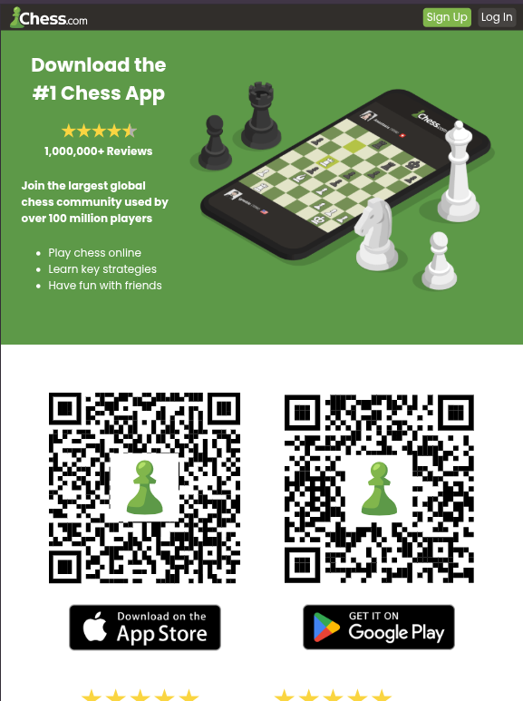
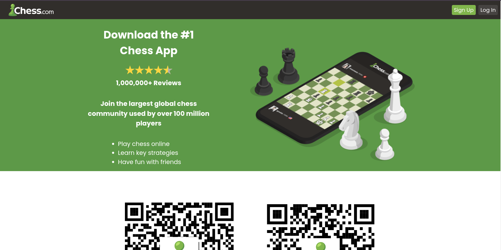
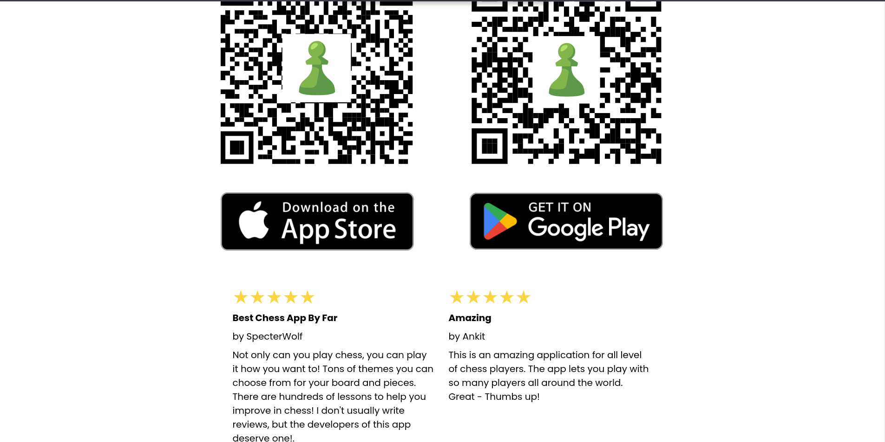
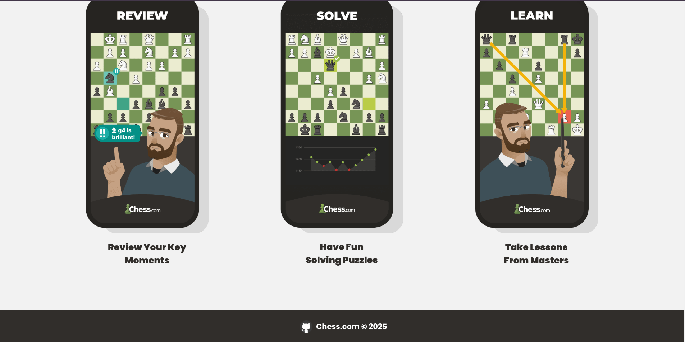

# Chess.com-Landing-Page-HTML-CSS

A simple Landing Page about the Chess.com App, was made in order to practice our HTML and CSS skills.

## Tech Stack

<div style="display: flex; align-items: center;">
  
  
</div>

## Features

- Responsive layout for all devices
- QR codes and call-to-action buttons to redirect for app download

## How to Use

```
git clone https://github.com/A4GOD-AMHG/Chess.com-Landing-Page-HTML-CSS.git
```

- Open index.html in your browser
- Explore the learning features presentation
- (Optional) Modify CSS styles in styles.css

## Screenshots







## Author

- Alexis Manuel Hurtado García (<https://github.com/A4GOD-AMHG>)
