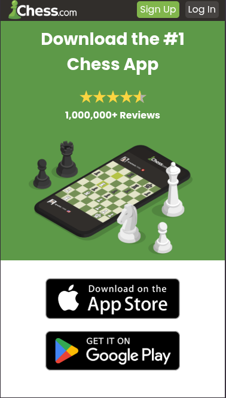

# Chess.com-Landing-Page-HTML-CSS

A simple Landing Page about the Chess.com App, was made in order to practice our HTML and CSS skills.

## Tech Stack

<div align="center" style="display: flex; justify-content: center; gap: 30px;">
  <div style="display: flex; flex-direction: column;">
    
    <span style="font-size: 20px; font-weight: bold">HTML 5</span>
  </div>
  <div style="display: flex; flex-direction: column;">
    
    <span style="font-size: 20px; font-weight: bold">CSS 3</span>
  </div>
</div>

## Features

- Responsive layout for all devices
- QR codes and call-to-action buttons to redirect for app download

## How to Use

```
git clone https://github.com/A4GOD-AMHG/Chess.com-Landing-Page-HTML-CSS.git
```

- Open index.html in your browser
- Explore the learning features presentation
- (Optional) Modify CSS styles in styles.css

## Screenshots

<div align="center" style="display: flex; justify-content: center; gap: 30px; flex-wrap: wrap; margin: 30px 0;">
  
  
  
  
  
</div>
